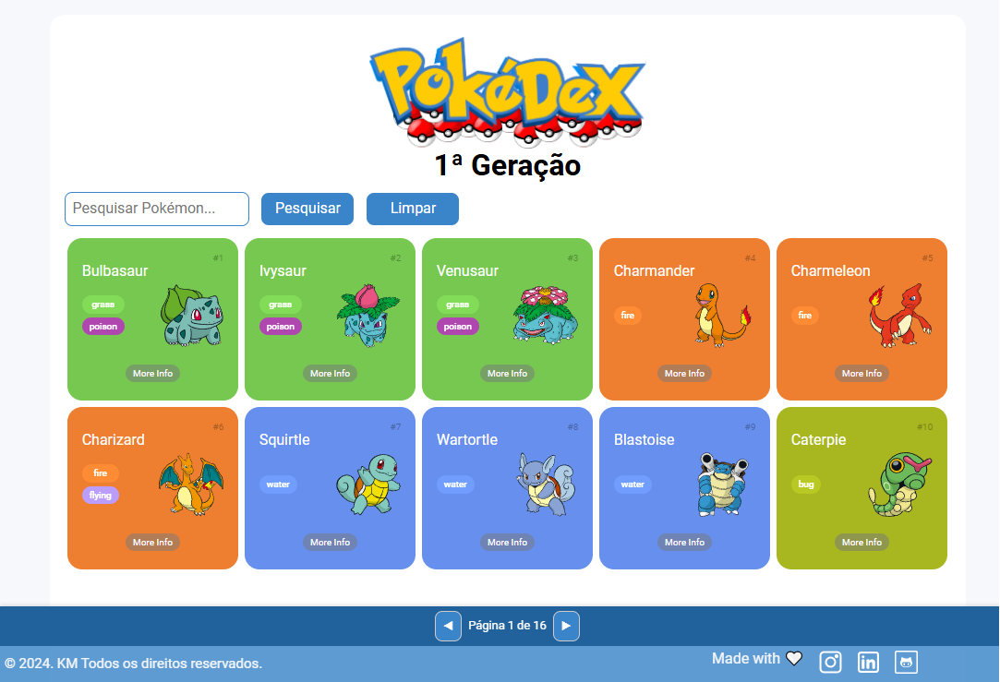

#  Pokédex


Seja bem-vindo ao projeto! Este repositório contém uma aplicação Pokédex interativa onde você pode navegar e explorar os detalhes dos 151 Pokémon originais. O projeto permite visualizar informações específicas de cada Pokémon ao clicar no botão "More Info", como habilidades, peso e altura.  Explore e aproveite!



## Índice

- Objetivo
- Descrição do Projeto
- Tecnologias Utilizadas
- Estrutura do Projeto
- Funcionalidades
- Funcionalidades Futuras
- Contribuições
- Contato
- Observações

## 🎯 Objetivo

A Pokédex foi desenvolvida para aprimorar habilidades em HTML, CSS e JavaScript, focando no consumo de APIs, manipulação de eventos e interatividade com o usuário. Além disso, o projeto oferece uma experiência de navegação intuitiva e responsiva ao usuário.

## 📖 Descrição do Projeto

Este projeto é uma Pokédex que utiliza a PokeAPI para acessar dados detalhados dos 151 Pokémon originais. Os usuários podem navegar pela lista de Pokémon, buscar por nome, e visualizar mais informações ao clicar no botão de detalhes. A lista é paginada para facilitar a navegação, e a interface é responsiva para melhor adaptação a diferentes tamanhos de tela.

## 🕹️ Como Utilizar

1. **Acessar a Página**:
   - Acesse a aplicação hospedada clicando [aqui](https://pokedex.vercel.app).
   - Ou abra o arquivo `index.html` localmente no navegador para visualização offline.

2. **Navegar pelos Pokémon**:
   - A página inicial exibe uma lista dos Pokémon disponíveis, com suas imagens, nomes e tipos.
   - Para ver mais Pokémon, use os botões de **Próxima** e **Anterior** para navegar entre as páginas.

3. **Pesquisar Pokémon**:
   - Digite o nome ou tipo do Pokémon desejado no campo de pesquisa.
   - Clique no botão de busca ou pressione **Enter**. (É necessário inserir ao menos três caracteres para iniciar a pesquisa).
   - Use o botão **Limpar Busca** para retornar à lista completa.

4. **Ver Detalhes**:
   - Clique no botão **Mais Info** em qualquer Pokémon da lista para abrir uma janela com detalhes específicos, como habilidades, altura e peso.

5. **Fechar Detalhes**:
   - Para fechar a janela de detalhes, clique no ícone de fechar no canto superior.

Explore e conheça mais sobre os Pokémon da primeira geração!


## 🛠️ Tecnologias Utilizadas


- **HTML5**: Para a estruturação do conteúdo.
- **CSS3**: Para estilização e design responsivo.
- **JavaScript**: Para manipulação de eventos, requisições de API e interatividade.

## 🗂️ Estrutura do Projeto

A organização dos arquivos no projeto é a seguinte:


```bash
| index.html
| README.md
| assets/
| ├── css/
| │   ├── global.css
| │   └── pokedex.css
| ├── images/
| │   └── [imagens e ícones]
| └── js/
|     ├── main.js
|     ├── modal.js
|     ├── poke-api.js
|     └── pokemon-model.js    
```


## ⚙️ Funcionalidades

- Exibir lista paginada dos 151 Pokémon.
- Visualizar detalhes de um Pokémon específico ao clicar em "Mais Info".
- Navegação entre páginas com botões "Anterior" e "Próximo".
- Função de busca por nome ou tipo, com alerta para entrada inválida.
- Exibição de detalhes do Pokémon selecionado, incluindo habilidades e estatísticas.
- Design responsivo que se adapta a diferentes dispositivos, garantindo uma boa experiência de uso.

## 🌟 Funcionalidades Futuras

- Filtragem por tipo de Pokémon.
- Adição de mais Pokémon além dos 151 originais.
- Implementar um sistema de favoritos para que os usuários possam salvar seus Pokémon preferidos.
- Adicionar a capacidade de comparar estatísticas entre diferentes Pokémon.
- Melhorar a interface com animações e transições mais fluidas.
- Melhoria na acessibilidade da interface para usuários de leitores de tela.
- Inclusão de informações sobre evoluções de Pokémon.

## 🤝 Contribuições

Contribuições são bem-vindas! Para contribuir:

- **Abra uma Issue:** Relate um bug ou sugira uma melhoria.
- **Crie um Pull Request:** Faça alterações no código e envie uma solicitação para revisão.

## 📧 Contato

Para dúvidas ou feedback, entre em contato:

- **E-mail:** [nina.kastro@icloud.com](mailto:nina.kastro@icloud.com)
- **LinkedIn:** [LinkedIn](https://www.linkedin.com/in/karinacmartins/)
- **GitHub:** [GitHub](https://github.com/karinacmartins)

## Observações

Para o correto funcionamento do projeto, é necessária conexão à internet para acessar a PokeAPI.

<br><br>

<div align="right">Made with 💜 by <a href="https://github.com/karinacmartins">KM</a>.</div>
